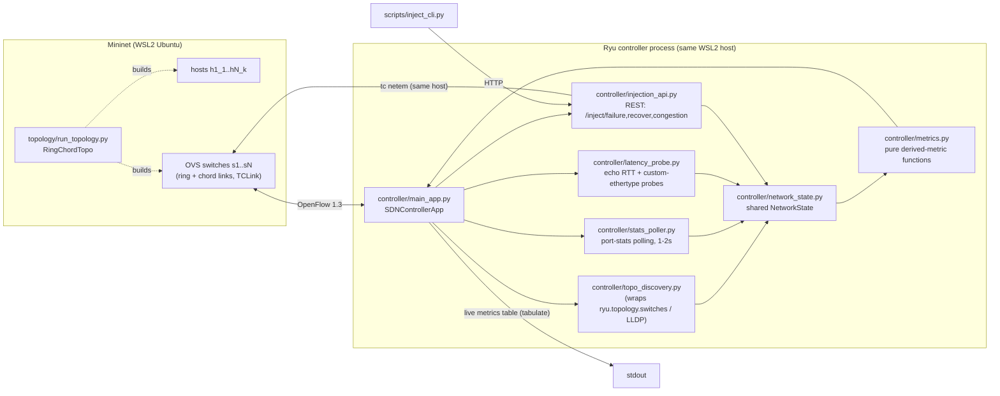
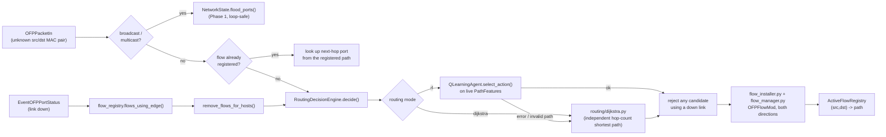

# Architecture

Living document, updated per phase. Covers Phase 1 (Network Emulation &
Statistics Collection) below, with a **Phase 3 (Routing & Flow Management)**
section further down covering how the Phase 2 RL agent actually gets used
at runtime.

## Phase 1 component diagram

## Modules

- **topology/** — everything needed to describe and build the emulated
  network, independent of Mininet actually being installed:
  - `config.py`: `TopologyConfig` / `LinkProfile` dataclasses (pure, no deps).
    Enforces NFR2's 6-10 switch range at construction time.
  - `graph.py`: builds the switch-level graph as a NetworkX **circulant
    graph** `C_n(1, chord_offsets...)` — offset 1 gives the ring (guarantees
    edge-connectivity >= 2 on its own, satisfying NFR3's "survive a single
    link failure" baseline even before chords are added), additional offsets
    add shortcut chords for extra redundancy and shorter alternate paths.
  - `ring_topology.py`: the actual `mininet.topo.Topo` subclass, built from
    the same graph so the emulated topology and the graph used for testing
    are provably the same structure.
  - `run_topology.py`: CLI (`sudo python3 -m topology.run_topology ...`)
    that starts Mininet with a `RemoteController` pointed at the Ryu app.

- **controller/** — the Ryu app (FR1: discovery + polling):
  - `main_app.py`: the `ryu-manager` entry point. Spawns three background
    green threads (`hub.spawn`): stats/echo polling, link delay probing, and
    the live metrics table printer. Also carries a minimal learning-switch
    packet-in handler as a Phase 1 stand-in for real forwarding — **Phase 3
    replaces this** with RL/Dijkstra-driven flow installation.
  - `topo_discovery.py`: thin wrapper over Ryu's built-in LLDP-based
    `ryu.topology.switches` app (via `ryu.topology.api`), mirroring the
    discovered switches/links into `NetworkState.graph`. We reuse Ryu's LLDP
    implementation rather than reimplementing it.
  - `stats_poller.py`: sends `OFPPortStatsRequest` to every connected
    datapath every `POLL_INTERVAL_SEC` (1.5s, inside FR1's 1-2s window), and
    turns replies into `PortSample` records.
  - `latency_probe.py`: the **hybrid delay measurement** (see "Delay
    measurement design" below).
  - `metrics.py`: pure functions computing the six RL state features from
    raw counters/samples. No Ryu/Mininet imports — unit-testable anywhere.
  - `network_state.py`: the shared, lock-protected state object every other
    module reads/writes (port sample history, echo RTTs, link delay
    history, link up/down + congestion-injected status, discovered graph).
  - `injection_validation.py` / `injection_api.py`: request validation and
    `tc` command building are pure (`injection_validation.py`, no Ryu/webob
    import); `injection_api.py` is the thin Ryu WSGI glue that calls into it.

- **scripts/inject_cli.py** — CLI wrapper that just POSTs to the injection
  REST API; no logic of its own, so there's a single source of truth.

- **tests/** — pure-Python unit tests (`test_topology_graph.py`,
  `test_metrics.py`, `test_injection_validation.py`) that run on any
  platform, no Mininet/Ryu required. Mininet/Ryu integration is verified
  manually inside WSL2 (see the Phase 1 test plan in the chat/README).

## Delay measurement design (why hybrid)

Raw OpenFlow `OFPPortStatsReply` gives byte/packet counters — never latency.
Two complementary signals feed the `delay_ms` state feature:

1. **Control-channel RTT** (`latency_probe.send_echo_request` /
   `handle_echo_reply`): periodic `OFPEchoRequest`/`Reply` per switch. This
   measures controller<->switch responsiveness, not link delay — but it's
   needed to net out overhead from signal 2, and independently feeds
   `link_trust_level` as a link-health indicator.
2. **Link delay probe** (`send_delay_probe` / `estimate_link_delay_ms`): a
   custom-ethertype (`0x8999`) packet sent controller -> switch A -> (the
   physical/virtual link) -> switch B -> controller (via the table-miss
   flow). The elapsed time, minus the two echo-derived control-channel
   latencies, estimates the link's actual one-way data-plane delay.

This estimate is validated against the **injectable ground truth**: each
link's `LinkProfile.delay_ms` in `topology/config.py` is applied as a real
`tc netem` delay by Mininet's `TCLink`, so in a controlled test we know what
the probe *should* converge to.

**Known limitation (be honest about scope):** the probe's accuracy depends
on the assumption that echo RTT symmetrically approximates each switch's
control-channel overhead in both directions, which is a simplification -
acceptable for a simulation-only project, not something we'd claim as
production-grade telemetry. See `/docs/security-notes.md` (Phase 5) and
`/docs/rl-design.md` (Phase 2) for how this feeds the RL state vector.

## Congestion/failure injection design

- **Failure** (`/inject/failure`, `/inject/recover`): a real OpenFlow
  `OFPPortMod` toggling `OFPPC_PORT_DOWN` on the target switch port. Clean,
  controller-native, no host access needed.
- **Congestion** (`/inject/congestion`): OpenFlow has no primitive for link
  delay/loss, so this shells out to `tc qdisc change ... netem` on the
  Mininet veth interface (`s<dpid>-eth<port>`). This only works because Ryu
  and Mininet run in the same Linux/WSL2 environment in this simulation —
  documented as a simulation-only shortcut, not something that would work
  against a real, physically separate switch.
- All three endpoints validate their JSON body through
  `controller/injection_validation.py` before touching OpenFlow or a shell
  command — dpid/port must be positive ints, delay/loss/bandwidth must fall
  within sane bounds. Auth is **not yet** added (Phase 5).

## Loop prevention in the Phase 1 fallback forwarding (found during manual testing)

The topology is deliberately built with loops (ring + chords, for path
diversity). Mininet's `OVSSwitch(stp=True)` only enables STP when
`failMode='standalone'` - useless here, since we run switches under a
remote controller in `secure` fail mode. That means loop prevention has to
happen in the controller itself, which is the correct place for an
SDN-native design anyway.

`NetworkState.sync_graph` computes a spanning tree (`nx.minimum_spanning_tree`,
unweighted - any spanning tree works, it just needs to break cycles) over the
discovered topology on every topology change, and `NetworkState.flood_ports`
uses it: a port floods only if it's host-facing (no discovered switch
neighbour) or its switch-to-switch link is on the spanning tree. Off-tree
chord links are excluded from *flooding* only - Phase 3's real RL/Dijkstra
routing installs explicit unicast flows and is not restricted to the tree.

This also required fixing how switch-to-switch links are mirrored into the
graph: `ryu.topology.api.get_link` returns each physical link as two `Link`
objects (A->B and B->A), but `NetworkX`'s `Graph` is undirected, so naively
adding both as separate edges silently overwrote one direction's port number
whichever was added last. Edges now carry a `ports: {dpid: local_port_no}`
dict merged from both directions instead of asymmetric `src_port`/`dst_port`
keys - `topo_discovery.py`.

**Symptom this fixed:** `pingall` reported 100% dropped, even between hosts
on the *same* switch, and the delay metric showed ~30-38 **seconds** instead
of ~5ms. Root cause: the naive flood-everything fallback broadcast-stormed
across the topology's loops on the very first ARP packet, saturating the
controller badly enough that echo replies (which the delay fallback depends
on) were processed only once, very late, and never again.

## Known Phase 1 limitations (tracked, not hidden)

- No authentication on the injection REST API yet (Phase 5).
- Congestion injection assumes controller and Mininet share a host (true in
  this WSL2 simulation, would not hold in a real deployment).
- Phase 1's flood-only fallback still handles broadcast/multicast traffic
  (ARP, etc.) and any unicast pair whose destination location isn't known
  yet - see the Phase 3 section below for the real RL/Dijkstra routing that
  now handles known unicast host pairs.
- Link bandwidth for utilization % comes from the switch-reported
  `curr_speed` (OpenFlow port desc) when available, falling back to
  `DEFAULT_LINK_BW_MBPS` — virtual veth interfaces sometimes report 0/unset
  speed, which is why the fallback exists.

## Phase 3 — Routing & Flow Management

Wires the Phase 2 RL agent (and a Dijkstra baseline) into the live
controller: real host-to-host traffic gets an actual path and OpenFlow flow
rules, not just Phase 1's flood-based placeholder.

### Modules

- **`routing/host_location.py`** — `HostLocationTracker`: MAC -> (dpid,
  port), learned the same way Phase 1 learned MACs (from `eth.src` on a
  host-facing port), just now also recording *which switch*.
- **`routing/dijkstra.py`** — the baseline. Deliberately its own
  `nx.shortest_path` call, not "candidate 0 of the RL's enumerated list" -
  keeping the two strategies independently implemented is what makes an
  RL-vs-baseline comparison (FR4) mean something.
- **`routing/decision_engine.py`** — `RoutingDecisionEngine.decide(src_mac,
  dst_mac)`: resolves host locations, enumerates candidate paths
  (`routing/path_enumeration.py`, reused from Phase 2), filters out any
  candidate using a currently-down link (`NetworkState.is_edge_up`), then
  either asks the RL agent (building live `PathFeatures` from
  `NetworkState.live_link_metrics` - the same live data the metrics table
  prints) or computes Dijkstra. **Any exception from the RL agent is caught
  and falls back to Dijkstra, logged with the reason** - NFR3's "fall back
  to baseline if RL agent fails," taken literally: a bug or bad input in the
  RL path can never leave a flow unrouted.
- **`routing/flow_installer.py`** — pure translation of a switch path + host
  MACs into per-hop `FlowInstallation`s (both directions, symmetric
  routing). **`controller/flow_manager.py`** is the thin Ryu glue that
  actually sends these as `OFPFlowMod` (and their deletion, for rerouting).
- **`routing/flow_registry.py`** — `ActiveFlowRegistry`: which path is
  currently installed for each host pair, so a link failure can find
  exactly the flows that need rerouting instead of touching everything.

### Failure-triggered rerouting (FR3, NFR1, NFR3)

`main_app.py` listens for `EventOFPPortStatus` directly (not
`ryu.topology`'s own `EventLinkDelete`, which is LLDP-timeout-based and too
slow for NFR1's 2-second bound) - a switch reports a port's state changing
essentially immediately over the OpenFlow control channel, including for our
own injected `/inject/failure` (`OFPPortMod`). On a down transition:
`NetworkState.is_edge_up` is updated, every flow in `ActiveFlowRegistry`
using that edge gets its old flow rules deleted and a fresh
`decision_engine.decide()` call, and (if a viable alternate path exists) new
flow rules installed - all synchronously in the event handler, no polling
delay. This phase deliberately does **not** proactively reroute flows just
because a link gets *congested* (not failed) - see CLAUDE.md's Phase 3
kickoff notes for that scoping decision; new flows still avoid known
congestion since the RL agent sees live utilization when deciding.

### Running the RL agent at inference time

`main_app.py` loads `models/q_agent.pkl` (Phase 2's trained checkpoint) at
startup via a `--rl-model-path` option, sets `epsilon=0` (greedy, no
exploration in production), and falls back to Dijkstra-only if the file is
missing (logged, not fatal). `--routing-mode {rl,dijkstra}` (a `ryu.cfg`
option, e.g. `ryu-manager --routing-mode dijkstra controller.main_app`)
switches strategies for **new** flows - existing installed flows aren't
retroactively changed by a mode switch, only by the failure-rerouting path
above.

### Known Phase 3 limitations (be honest about scope)

- No proactive congestion-based rerouting of already-installed flows (see
  above) - a deliberate Phase 3 scoping choice, not an oversight.
- Symmetric routing only: a host pair's forward and reverse traffic always
  share the same physical path. Simpler and more predictable for testing,
  at the cost of not exploiting fully independent per-direction routing.
- L2 (MAC-based) flow matching only, matching Phase 1's placeholder and the
  topology's flat single-broadcast-domain design - no L3/IP routing between
  subnets, because there are no subnets in this topology.
- The RL agent's Q-table was trained entirely in Phase 2's simulator
  (`rl/environment.py`); this is the first phase where its decisions face
  real Mininet traffic, and its state-space coverage may be sparse for
  network conditions the simulator didn't emphasize.
