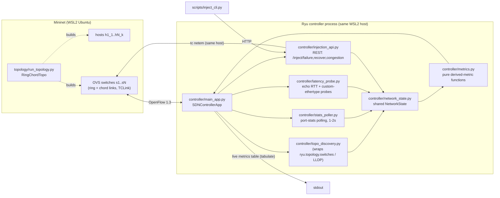

# Architecture

Living document, updated per phase. This revision covers **Phase 1 — Network
Emulation & Statistics Collection**.

## Phase 1 component diagram

## Modules

- **topology/** — everything needed to describe and build the emulated
  network, independent of Mininet actually being installed:
  - `config.py`: `TopologyConfig` / `LinkProfile` dataclasses (pure, no deps).
    Enforces NFR2's 6-10 switch range at construction time.
  - `graph.py`: builds the switch-level graph as a NetworkX **circulant
    graph** `C_n(1, chord_offsets...)` — offset 1 gives the ring (guarantees
    edge-connectivity >= 2 on its own, satisfying NFR3's "survive a single
    link failure" baseline even before chords are added), additional offsets
    add shortcut chords for extra redundancy and shorter alternate paths.
  - `ring_topology.py`: the actual `mininet.topo.Topo` subclass, built from
    the same graph so the emulated topology and the graph used for testing
    are provably the same structure.
  - `run_topology.py`: CLI (`sudo python3 -m topology.run_topology ...`)
    that starts Mininet with a `RemoteController` pointed at the Ryu app.

- **controller/** — the Ryu app (FR1: discovery + polling):
  - `main_app.py`: the `ryu-manager` entry point. Spawns three background
    green threads (`hub.spawn`): stats/echo polling, link delay probing, and
    the live metrics table printer. Also carries a minimal learning-switch
    packet-in handler as a Phase 1 stand-in for real forwarding — **Phase 3
    replaces this** with RL/Dijkstra-driven flow installation.
  - `topo_discovery.py`: thin wrapper over Ryu's built-in LLDP-based
    `ryu.topology.switches` app (via `ryu.topology.api`), mirroring the
    discovered switches/links into `NetworkState.graph`. We reuse Ryu's LLDP
    implementation rather than reimplementing it.
  - `stats_poller.py`: sends `OFPPortStatsRequest` to every connected
    datapath every `POLL_INTERVAL_SEC` (1.5s, inside FR1's 1-2s window), and
    turns replies into `PortSample` records.
  - `latency_probe.py`: the **hybrid delay measurement** (see "Delay
    measurement design" below).
  - `metrics.py`: pure functions computing the six RL state features from
    raw counters/samples. No Ryu/Mininet imports — unit-testable anywhere.
  - `network_state.py`: the shared, lock-protected state object every other
    module reads/writes (port sample history, echo RTTs, link delay
    history, link up/down + congestion-injected status, discovered graph).
  - `injection_validation.py` / `injection_api.py`: request validation and
    `tc` command building are pure (`injection_validation.py`, no Ryu/webob
    import); `injection_api.py` is the thin Ryu WSGI glue that calls into it.

- **scripts/inject_cli.py** — CLI wrapper that just POSTs to the injection
  REST API; no logic of its own, so there's a single source of truth.

- **tests/** — pure-Python unit tests (`test_topology_graph.py`,
  `test_metrics.py`, `test_injection_validation.py`) that run on any
  platform, no Mininet/Ryu required. Mininet/Ryu integration is verified
  manually inside WSL2 (see the Phase 1 test plan in the chat/README).

## Delay measurement design (why hybrid)

Raw OpenFlow `OFPPortStatsReply` gives byte/packet counters — never latency.
Two complementary signals feed the `delay_ms` state feature:

1. **Control-channel RTT** (`latency_probe.send_echo_request` /
   `handle_echo_reply`): periodic `OFPEchoRequest`/`Reply` per switch. This
   measures controller<->switch responsiveness, not link delay — but it's
   needed to net out overhead from signal 2, and independently feeds
   `link_trust_level` as a link-health indicator.
2. **Link delay probe** (`send_delay_probe` / `estimate_link_delay_ms`): a
   custom-ethertype (`0x8999`) packet sent controller -> switch A -> (the
   physical/virtual link) -> switch B -> controller (via the table-miss
   flow). The elapsed time, minus the two echo-derived control-channel
   latencies, estimates the link's actual one-way data-plane delay.

This estimate is validated against the **injectable ground truth**: each
link's `LinkProfile.delay_ms` in `topology/config.py` is applied as a real
`tc netem` delay by Mininet's `TCLink`, so in a controlled test we know what
the probe *should* converge to.

**Known limitation (be honest about scope):** the probe's accuracy depends
on the assumption that echo RTT symmetrically approximates each switch's
control-channel overhead in both directions, which is a simplification -
acceptable for a simulation-only project, not something we'd claim as
production-grade telemetry. See `/docs/security-notes.md` (Phase 5) and
`/docs/rl-design.md` (Phase 2) for how this feeds the RL state vector.

## Congestion/failure injection design

- **Failure** (`/inject/failure`, `/inject/recover`): a real OpenFlow
  `OFPPortMod` toggling `OFPPC_PORT_DOWN` on the target switch port. Clean,
  controller-native, no host access needed.
- **Congestion** (`/inject/congestion`): OpenFlow has no primitive for link
  delay/loss, so this shells out to `tc qdisc change ... netem` on the
  Mininet veth interface (`s<dpid>-eth<port>`). This only works because Ryu
  and Mininet run in the same Linux/WSL2 environment in this simulation —
  documented as a simulation-only shortcut, not something that would work
  against a real, physically separate switch.
- All three endpoints validate their JSON body through
  `controller/injection_validation.py` before touching OpenFlow or a shell
  command — dpid/port must be positive ints, delay/loss/bandwidth must fall
  within sane bounds. Auth is **not yet** added (Phase 5).

## Known Phase 1 limitations (tracked, not hidden)

- No authentication on the injection REST API yet (Phase 5).
- Congestion injection assumes controller and Mininet share a host (true in
  this WSL2 simulation, would not hold in a real deployment).
- The learning-switch packet-in fallback in `main_app.py` is intentionally
  minimal — it exists only so Phase 1 has real traffic to measure; it is not
  the routing logic the project is about (that's Phase 3).
- Link bandwidth for utilization % comes from the switch-reported
  `curr_speed` (OpenFlow port desc) when available, falling back to
  `DEFAULT_LINK_BW_MBPS` — virtual veth interfaces sometimes report 0/unset
  speed, which is why the fallback exists.
